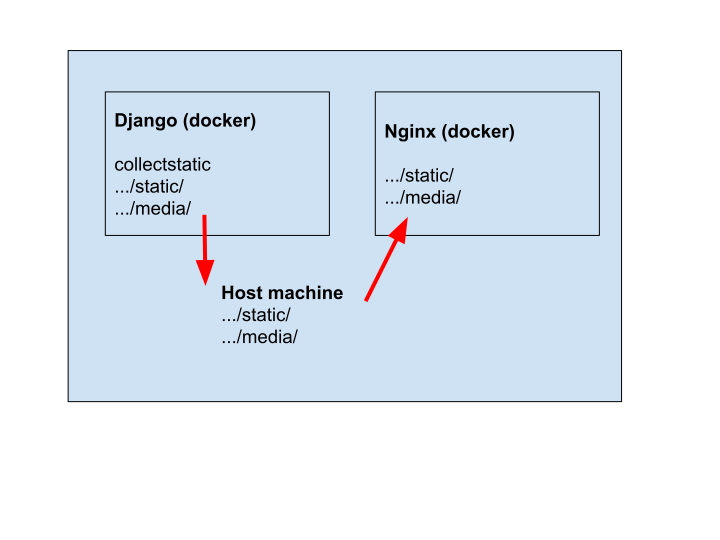

炮制了一个框架，  方便Django开发后快速部署。 

`docker_django/`是Django程序的根目录。    
`docker_others/`的子目录是各种周边软件个根目录。  
有密码的文件需注意，考虑用环境变量传入。

启动！  
`docker-compuse up --build`

~~~ c
+---docker_django
|   +---app_django
|   |   +--- settings.py   //有密码
|   |   +--- wsgi.py
|   |
|   +---manage.py
|   +---env     //开发用，部署时没有用。
|   +---media  //静态文件 host mount
|   +---static  //静态文件 host mount
|   +---requirements.txt
|   |
|   +---Dockerfile
|   +---start.sh
|   +---uwsgi.ini
|
+---docker_others
|   +---mysql
|   +---nginx
|   +---redis
|
+---docker-compose // 有密码
|
+---volume_mysql  // host mount
|
+---(volume_static)  // host mount (另一种方案，暂时不用)
+---(volume_media)  // host mount (另一种方案，暂时不用)
~~~

# 1. django + uWSGI
Windows can not pip install uwsgi

Alpine also can not pip install uwsgi  
**solution:**   
RUN apk add python3-dev build-base linux-headers pcre-dev

uwsgi --ini has problem reading .ini file  
**solution**:   
run as cmd line ( sh start.sh )  
remove the guid, www-data parameters which you don't understand.

# 2. nginx
The confusion is from development or deploy model (DEBUG=TRUE/FALSE)    
nginx一个重要作用就是快速处理静态文件。  
nginx能够访问django的静态文件，是因为做了三件事情:  
1. django(docker) collectstatic把文件放入了STATIC_ROOT(docker)  
2. django(docker) 和宿主机有同步, 这里面是放在了 `./app_django/static/`  
3. nginx(docker) 和宿主机也有同步，把 `./app_django/static/` 复制到了 nginx docker内部的专用目录了，最后这个目录在 `nginx.conf` 中被指名道姓，即便django停止运行，网页也能访问到这些静态文件。

# 3. add mysql
可以用docker-compose volumes参数的方式把宿主文件送入docker。  
但是我没有写文件，仅仅在docker-compose里写了简单的参数。

pip安装mysqlclient不是很顺利，需要alpine add （参见`./docker_django/dockerfile`)

# 4. 后续
* s3作为media和static地址。
* 如何维护数据库?
* Redis怎么用?
* nginx怎么设置ssl?

# 参考资料

[使用uWSGI和nginx来设置Django和你的web服务器
](https://uwsgi-docs-zh.readthedocs.io/zh_CN/latest/tutorials/Django_and_nginx.html "read the docs")  

[Docker完美部署Django Uwsgi+Nginx+MySQL+Redis](https://zhuanlan.zhihu.com/p/145364353 "Zhihu专栏")
